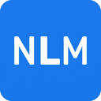

# Send to NotebookLM 🚀

An unofficial Chrome Extension to instantly capture web pages and text to Google NotebookLM.



## ✨ Features

- **One-Click Capture**: Add the current web page URL as a source to any of your notebooks.
- **Context Menu Integration**: Right-click on any selected text to add it directly to your last selected notebook.
- **Notebook Selection**: Automatically fetches and lists your NotebookLM notebooks (up to 50).
- **Smart Persistence**: Remembers your last selected notebook for faster capturing.
- **Modern UI**: Clean, responsive interface built with Shadcn UI and Tailwind CSS.
- **Privacy Focused**: Your content goes directly to NotebookLM. We use Supabase for anonymous usage tracking and Stripe for payments (Pro tier). No personal data is collected or sold.

## 🛠️ Installation

### Developer Mode (Unpacked)

Since this is an unofficial extension, you need to load it in Developer Mode:

1.  **Clone the repository:**
    ```bash
    git clone https://github.com/alexlevy0/send-to-notebooklm.git
    cd send-to-notebooklm
    ```

2.  **Install dependencies and build:**
    ```bash
    npm install
    npm run build
    # This will generate the `dist` folder ready for Chrome
    ```

3.  **Load in Chrome:**
    - Open Chrome and navigate to `chrome://extensions`.
    - Enable **Developer mode** (top right toggle).
    - Click **Load unpacked**.
    - Select the `dist` folder from the project directory.

## 🚀 Usage

1.  **Pin the Extension**: Click the puzzle piece icon in Chrome and pin "Send to NotebookLM".
2.  **Log in**: Ensure you are logged into [NotebookLM](https://notebooklm.google.com).
3.  **Select a Notebook**: Open the extension popup. It will list your notebooks. Click one to select it.
4.  **Capture Page**: Clicking a notebook also captures the current page URL immediately.
5.  **Capture Text**: Highlight text on any page, right-click, and select "Send to NotebookLM".

## 🏗️ Tech Stack

- **Framework**: [Next.js 16](https://nextjs.org/) (Static Export)
- **UI Components**: [Shadcn UI](https://ui.shadcn.com/)
- **Styling**: [Tailwind CSS](https://tailwindcss.com/)
- **Linting**: [Biome](https://biomejs.dev/)
- **Browser API**: Chrome Extensions Manifest V3

## 🤝 Contributing

Contributions are welcome! Please feel free to submit a Pull Request.

1.  Fork the project
2.  Create your feature branch (`git checkout -b feature/AmazingFeature`)
3.  Commit your changes (`git commit -m 'Add some AmazingFeature'`)
4.  Push to the branch (`git push origin feature/AmazingFeature`)
5.  Open a Pull Request

## ⚠️ Disclaimer

This project is **unofficial** and is not affiliated with, endorsed by, or connected to Google or NotebookLM.

## 📄 License

Distributed under the MIT License. See `LICENSE` for more information.
